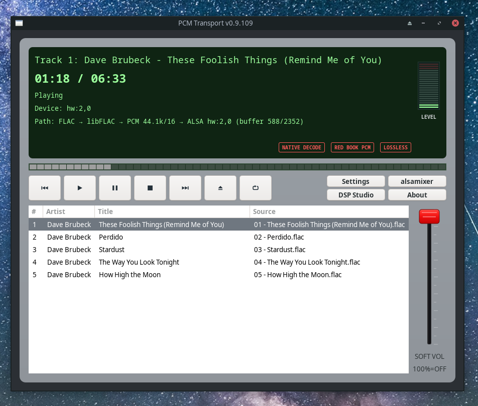
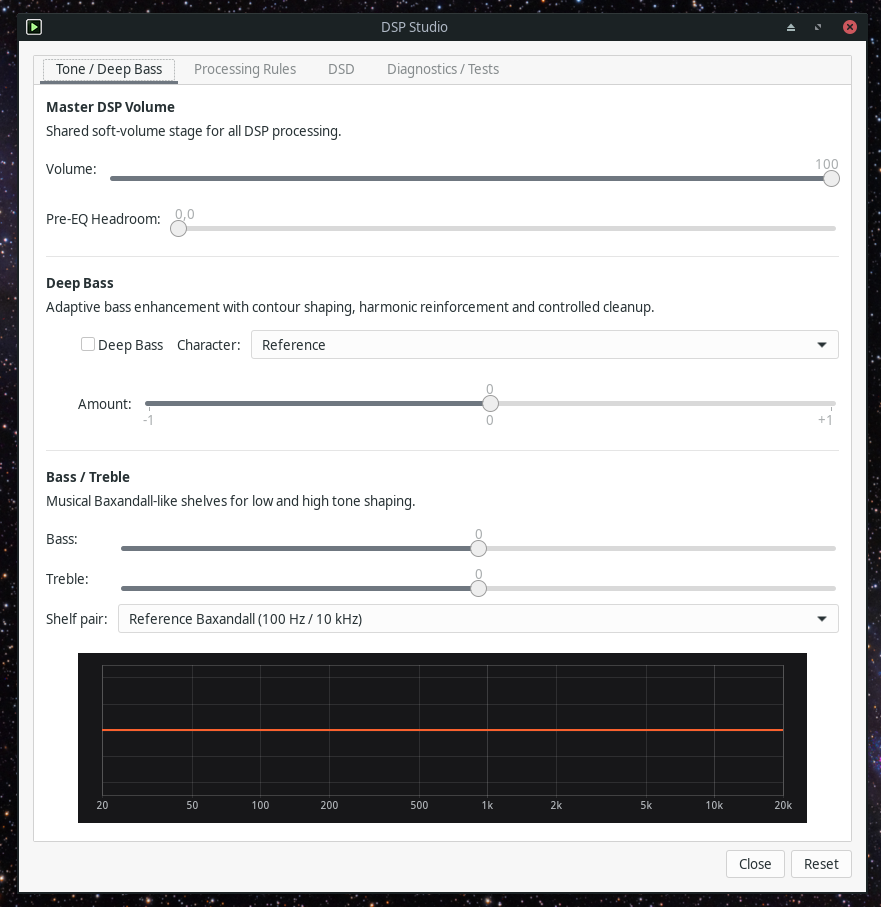

# PCM Transport v0.9.110

**PCM Transport** is a Linux desktop audio player focused on direct PCM playback, predictable DSP, and clear signal-path reporting.

---

## Author

**Andrey Berestov**

Website: https://andreyberestov.github.io/pcm-transport/

© 2026 Andrey Berestov

---

## Screenshots

### Main window


### DSP Studio


---

## Features

- GTK 3 desktop interface
- Direct ALSA output
- Native FLAC decoding through libFLAC
- Runtime FFmpeg/FFprobe support for MP3, M4A, AAC, OGG, WAV, AIFF, APE, WV and other formats
- CUE support, including continuous CUE image playback
- Local M3U / M3U8 playlist import
- UTF-8 and Windows-1251 normalization for legacy metadata
- Same-format gapless playback where possible
- Optional SoXr resampling and bit-depth rules
- Baxandall-style Bass/Treble controls and Deep Bass presets
- MPRIS integration (media keys, cover art) — initial work by [@loki1368](https://github.com/loki1368), further refined


---

## Supported formats

Native / primary:

```text
*.flac
*.wav
*.wave
*.cue
*.m3u
*.m3u8
```

FFmpeg-backed lossless / PCM / container formats:

```text
*.aif
*.aiff
*.ape
*.wv
*.w64
*.bwf
*.au
*.snd
*.caf
*.voc
*.tak
*.tta
*.dsf
*.dff
```

FFmpeg-backed lossy formats:

```text
*.mp3
*.mp2
*.m4a
*.m4r
*.aac
*.ac3
*.dts
*.ogg
*.oga
*.opus
*.spx
*.ra
*.wma
*.asf
*.xwma
*.wmv
*.oma
*.aa3
*.at3
*.mpc
*.mp+
*.mpp
```

FFmpeg-backed formats require `ffmpeg` and `ffprobe` at runtime. Rare-format support depends on the local FFmpeg build.

## Playback notes

- For the cleanest ALSA path, select a direct `hw:X,Y` device and avoid forced conversion rules.
- DSP is bypassed when Bass/Treble are neutral, volume is 100%, Pre-EQ Headroom is 0 dB, and Deep Bass is off.
- Native FLAC is used when no Processing Rules are applied.
- DSD sources (DSF/DFF) are played via PCM conversion; native DSD output is not available.

---

## AppImage

A ready-to-run Linux x86_64 AppImage is available on the GitHub Releases page.

Recommended asset name:

```text
PCM-Transport-latest-x86_64.AppImage
```

Run:

```bash
chmod +x PCM-Transport-latest-x86_64.AppImage
./PCM-Transport-latest-x86_64.AppImage
```

---

## Dependencies

### Arch Linux

```bash
sudo pacman -S --needed base-devel cmake pkgconf alsa-lib flac gtk3 ffmpeg
```

### Debian / Ubuntu

```bash
sudo apt install build-essential cmake pkg-config \
    libasound2-dev libflac-dev libgtk-3-dev ffmpeg
```

### ALT Linux

```bash
su -
apt-get install build-essential cmake pkg-config libalsa-devel libflac-devel libgtk+3-devel ffmpeg
exit
```

### Runtime

- ALSA
- GTK 3
- libFLAC
- ffmpeg
- ffprobe
- rtkit-daemon (optional, for RTKit realtime audio-thread priority)
- pkexec and setcap (optional, for granting persistent cap_sys_nice realtime permission)

Native FLAC playback works without FFmpeg. FFmpeg and FFprobe are required for external formats, metadata probing and conversion paths. RTKit support uses GLib/GIO D-Bus from GTK 3; no separate RTKit build dependency is required. Persistent realtime permission can be granted with pkexec/setcap cap_sys_nice and requires a player restart.

---

## Build

```bash
cmake -S . -B build
cmake --build build -j
```

CMake generates the embedded GLib resources automatically through `glib-compile-resources`.

---

## Run

```bash
./build/pcm_transport
```

The embedded application icons are available when running directly from `build`.

---

## Install — optional desktop integration

```bash
cmake --install build --prefix <prefix>
```

This optional desktop integration installs the binary, desktop entry and hicolor application icons under the selected prefix. Installation is not required for running from `build`.

---

## Compatibility

- C++17
- GTK 3
- Arch, Debian, Ubuntu, ALT Linux and similar Linux distributions
- X11 and Wayland through GTK

---

## Development note

PCM Transport is an independently maintained project developed with the assistance of AI coding tools. The project author defines the requirements and product direction, reviews and integrates changes, and tests each release before publication.

---

## License

GNU General Public License v3.0. See `LICENSE`.
