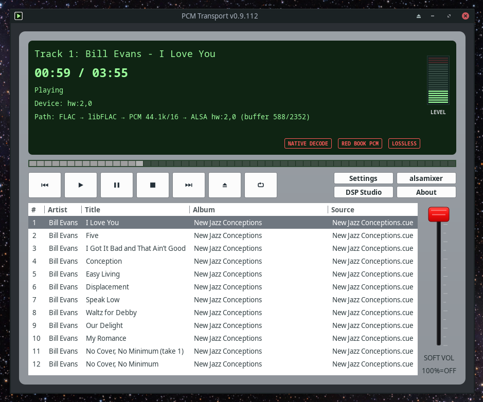
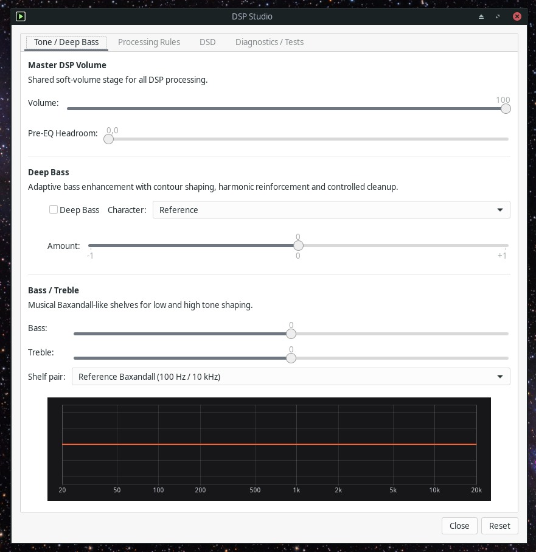

# PCM Transport v0.9.119

**PCM Transport** is a Linux desktop audio player focused on direct PCM playback, predictable DSP, and clear signal-path reporting.

---

## Author and Maintainer

[Andrey Berestov (@andreyberestov)](https://github.com/andreyberestov)

Contributors:

[Aleksandr Vysotskiy (@loki1368)](https://github.com/loki1368)

Website: https://andreyberestov.github.io/pcm-transport/

PCM Transport — Copyright © 2026 Andrey Berestov.
Portions copyright © 2026 PCM Transport contributors.

---

## Screenshots

### Main window


### DSP Studio


---

## Features

- GTK 3 desktop interface
- Direct ALSA output
- Native FLAC decoding through libFLAC
- Direct FFmpeg library decoding for MP3, M4A, OGG, WAV, AIFF, APE, WV and other formats
- CUE support, including continuous CUE image playback
- Local M3U / M3U8 playlist import
- UTF-8 and Windows-1251 normalization for legacy metadata
- Same-format gapless playback where possible
- Optional SoXR sample-rate conversion and configurable output precision
- Baxandall-style Bass/Treble controls
- MPRIS integration (media keys, cover art)

---

## Supported formats

Native / primary:

```text
*.flac
*.wav
*.wave
*.cue
*.m3u
*.m3u8
```

FFmpeg library-backed lossless / PCM / container formats:

```text
*.aif
*.aiff
*.ape
*.wv
*.w64
*.bwf
*.au
*.snd
*.caf
*.voc
*.tak
*.tta
*.dsf
*.dff
```

FFmpeg library-backed lossy formats:

```text
*.mp3
*.mp2
*.m4a
*.m4r
*.aac
*.ac3
*.dts
*.ogg
*.oga
*.opus
*.spx
*.ra
*.wma
*.asf
*.xwma
*.wmv
*.oma
*.aa3
*.at3
*.mpc
*.mp+
*.mpp
```

FFmpeg-backed formats use the libavformat, libavcodec, libavutil and
libswresample shared libraries. The ffmpeg and ffprobe command-line
tools are not required. Rare-format support depends on the local
FFmpeg library build.

## Playback notes

- For the cleanest ALSA path, select a direct `hw:X,Y` device and avoid forced conversion rules.
- DSP is bypassed when Bass/Treble are neutral, volume is 100%, and Pre-EQ Headroom is 0 dB.
- The CLIP indicator reports DSP-path clipping only; it is not a full-chain detector.
- Native FLAC is used when no Processing Rules are applied.
- DSD sources (DSF/DFF) are played via PCM conversion; native DSD output is not available.

---
## Command-line opening

Local audio files, playlists, CUE sheets and directories can be opened directly from the command line:

```bash
./build/pcm_transport <path> [<path>...]
```

Examples:

```bash
./build/pcm_transport album.flac
./build/pcm_transport album.cue
./build/pcm_transport playlist.m3u8
./build/pcm_transport "/home/user/Music/My Album"
./build/pcm_transport track01.flac track02.flac
```

When PCM Transport is already running, new paths are opened in the existing application instance.

Use -- before a path that begins with a hyphen:

```bash
./build/pcm_transport -- "-track.flac"
```

---

## AppImage

A ready-to-run Linux x86_64 AppImage is available on the GitHub Releases page.

Recommended asset name:

```text
PCM-Transport-latest-x86_64.AppImage
```

Run:

```bash
chmod +x PCM-Transport-latest-x86_64.AppImage
./PCM-Transport-latest-x86_64.AppImage
```

---

## Dependencies

### Arch Linux

```bash
sudo pacman -S --needed base-devel cmake pkgconf alsa-lib flac gtk3 ffmpeg curl openssl
```

### Debian / Ubuntu

```bash
sudo apt install build-essential cmake pkg-config \
    libasound2-dev libflac-dev libgtk-3-dev \
    libavformat-dev libavcodec-dev libavutil-dev libswresample-dev \
    libcurl4-openssl-dev libssl-dev
```

### ALT Linux

```bash
su -
apt-get install build-essential cmake pkg-config \
    libalsa-devel libflac-devel libgtk+3-devel \
    libavformat-devel libavcodec-devel libavutil-devel libswresample-devel \
    libcurl-devel libssl-devel
exit
```

### Runtime

- ALSA
- GTK 3.16 or newer
- GLib / GIO 2.52 or newer
- libFLAC 1.3.3 or newer
- FFmpeg 4.4 or newer shared libraries: libavformat, libavcodec, libavutil and libswresample
- libcurl (remote M3U/M3U8 playlist fetch)
- OpenSSL (HTTPS ICY metadata sidecar)
- rtkit-daemon (optional, for RTKit realtime audio-thread priority)
- pkexec and setcap (optional, for granting persistent cap_sys_nice realtime permission)

PCM Transport targets source compatibility from FFmpeg 4.4 and libFLAC
1.3.3 through current mainstream releases using public library APIs. Newer
library versions may enable stronger optional capabilities; on the supported
baseline, unavailable optional capabilities degrade conservatively without
disabling normal playback. Cross-major FFmpeg ABI compatibility is not
assumed; build against the libraries supplied by the target distribution.

FLAC decoding remains native through libFLAC when no Processing Rules
are active. PCM Transport is also linked against the FFmpeg shared
libraries for other formats, metadata fallback and conversion paths.
The ffmpeg and ffprobe command-line tools are not used. RTKit support uses GLib/GIO 2.52+ D-Bus; no separate RTKit build dependency is required. Direct realtime permission can be granted through pkexec/setcap cap_sys_nice and requires a player restart.

---

## Build

```bash
cmake -S . -B build
cmake --build build -j
```

CMake generates the embedded GLib resources automatically through `glib-compile-resources`.

---

## Run

```bash
./build/pcm_transport
```

The embedded application icons are available when running directly from `build`.

---

## Install — optional desktop integration

```bash
cmake --install build --prefix <prefix>
```

User-local installation example:

```bash
cmake --install build --prefix ~/.local
```

This optional desktop integration installs the binary, desktop entry and hicolor application icons under the selected prefix. It also enables opening supported audio files, playlists, CUE sheets and directories from compatible Linux file managers. Installation is not required for running from `build`.

Some desktop environments may require refreshing their application and icon caches before PCM Transport appears in application or “Open With” menus.

If the application does not appear in your menu or file associations do not work immediately, please log out and log back into your desktop session. This ensures all desktop caches are rebuilt for your environment.

---

## Compatibility

- Arch, Debian, Ubuntu, ALT Linux and similar Linux distributions
- X11 and Wayland through GTK

---

## Development note

PCM Transport is an independently maintained project developed with the assistance of AI coding tools. The project maintainer defines the requirements and product direction, reviews and integrates changes, and tests each release before publication.

---

## License

GNU General Public License v3.0 only (`GPL-3.0-only`). See `LICENSE`.

Third-party component notices: `THIRD_PARTY_NOTICES.md`.
